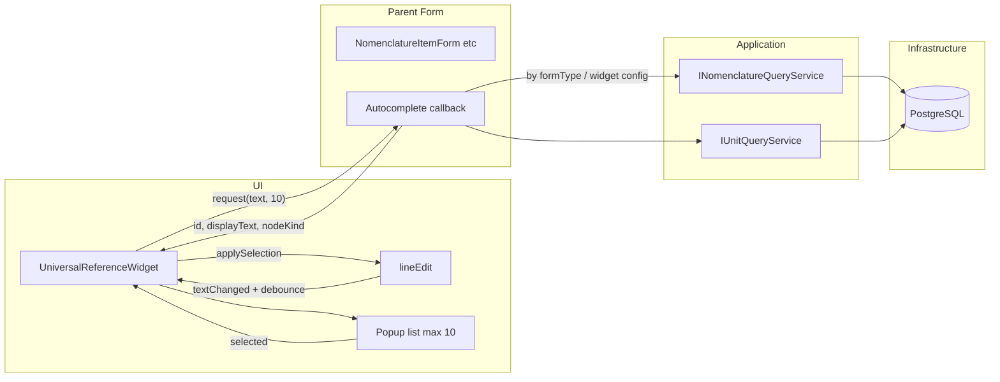

# План: автозаповнення в UniversalReferenceWidget

## Поточна ситуація

- **[UniversalReferenceWidget](src/ui/widgets/UniversalReferenceWidget.cpp)**: містить `lineEdit` (зараз `setReadOnly(true)`), кнопки вибору/очищення/відкриття. Віджет знає `referenceKey`, `choiceFormType`, `allowedNodeKinds`; не має доступу до БД або сервісів.
- **Батьківські форми** ([NomenclatureItemForm](src/ui/forms/catalogs/nomenclature/NomenclatureItemForm.cpp), [NomenclatureGroupForm](src/ui/forms/catalogs/nomenclature/NomenclatureGroupForm.cpp)) володіють сервісами (наприклад `INomenclatureQueryService`, `IUnitQueryService`) і підключають `selectRequested` для відкриття форми вибору.
- **Довідники**: nomenclature (таблиця `nomenclature`: code, description, article, folder; окремо `nomenclature_barcodes` для barcode), units (таблиця `units`: code, description). Документи (FormType є, сервіси закоментовані в [ApplicationBootstrapper](src/app/ApplicationBootstrapper.cpp)) — автозаповнення для документів реалізувати за тим самим шаблоном після підключення сервісів.

## Архітектура рішення

- **Віджет не залежить від конкретного типу довідника/документа.** Джерело варіантів передається ззовні: батьківська форма реєструє callback (або інтерфейс), який за рядком пошуку та лімітом повертає список записів для показу.
- **Єдиний формат запису для віджета**: `(id, displayText, nodeKind)`. Текст рядка (назва + номер + дата для документів; description + code для довідників) формується в application/infrastructure; віджет лише показує список і викликає `applySelection(id, displayText, nodeKind)` при виборі.
- **Пауза перед запитом**: таймер (наприклад 250–350 мс) після останнього введення символу; при новому вводі таймер скидається.
- **Максимум 10 рядків** у випадаючому списку — обмеження на рівні методів пошуку (limit=10).

## 1. Тип запису автозаповнення та API віджета

- Ввести тип запису для одного варіанту, наприклад у [ReferenceFieldPolicy.h](src/application/forms/ReferenceFieldPolicy.h) або в заголовку віджета:
  - `struct AutocompleteEntry { QByteArray id; QString displayText; AllowedNodeKinds nodeKind; };`
- У **[UniversalReferenceWidget](src/ui/widgets/UniversalReferenceWidget.h)**:
  - Додати спосіб передачі джерела даних: наприклад `setAutocompleteSource(std::function<QVector<AutocompleteEntry>(QString search, int limit)> source)` або приймач слоту з сигналом, що доставляє результат (якщо потрібна асинхронність).
  - Якщо джерело не встановлене — автозаповнення не показується (поведінка лишається як зараз: тільки кнопка вибору).
- **Поведінка lineEdit**: зробити поле доступним для вводу (прибрати або умовно не вмикати `setReadOnly(true)`), щоб користувач міг вводити символи; після вибору з випадаючого списку викликати `applySelection` і оновити текст у lineEdit.

## 2. Логіка в UniversalReferenceWidget (реалізація)

- **Таймер**: при `textChanged` перезапускати single-shot таймер (наприклад 300 мс). При спрацьовуванні — якщо текст не порожній і джерело встановлене — викликати джерело з `search = text.trimmed()`, `limit = 10`.
- **Відображення**: випадаючий список (наприклад через `QCompleter` з власним popup або власний popup з `QListWidget`/моделлю), максимум 10 рядків; рядки — лише `displayText` з отриманих `AutocompleteEntry`. Зберігати для списку відповідний вектор `AutocompleteEntry`, щоб при виборі за індексом викликати `applySelection(entry.id, entry.displayText, entry.nodeKind)`.
- **Приховування/скасування**: при втраті фокусу або Escape закривати popup; при виборі — застосовувати значення і закривати popup.
- **Обмеження**: не показувати popup при порожньому пошуку; обробляти випадок, коли віджет налаштований тільки на кнопку вибору (немає джерела автозаповнення).

**Поведінка (уточнення, за аналогією з 1С):**

- **Мінімум символів**: список показується при будь-якому вводі після паузи (включно з 1 символом); окреме обмеження на мінімальну кількість символів не вводити.
- **Порожнє поле при фокусі**: коли поле порожнє і отримує фокус, випадаючий список не показувати; показ тільки після того, як користувач почав вводити символи.
- **Клавіатура**: у випадаючому списку підтримати навігацію стрілками (Up/Down) та вибір Enter (як у 1С).

## 3. Application: методи пошуку для автозаповнення

- **Довідники з ієрархією (групи + елементи), зокрема номенклатура**  
Додати в [INomenclatureQueryService](src/application/catalogs/nomenclature/INomenclatureQueryService.h) метод на кшталт:
  - `QVector<AutocompleteEntry> searchForAutocomplete(const QString& searchText, AllowedNodeKinds allowedKinds, int limit);`  
  Поведінка:
  - LIKE по `description`, `code`; для номенклатури також по `article` та по `barcode` (через зв'язок з `nomenclature_barcodes`), з уникненням дублікатів по `n.idrref`.
  - Фільтр за типом вузла: `FoldersOnly` → `folder = true`, `ItemsOnly` → `folder = false`, `ItemsAndFolders` → без фільтра по `folder`.
  - Формат рядка: `description` потім `code` (наприклад `description + " " + code`).
  - Повертати не більше `limit` записів (у проєкті використовувати 10).
- **Плоский довідник (одиниці виміру)**  
У [IUnitQueryService](src/application/catalogs/units/IUnitQueryService.h) додати, наприклад:
  - `QVector<AutocompleteEntry> searchForAutocomplete(const QString& searchText, int limit);`  
  Пошук за `code` та `description` (ILIKE), формат рядка: `description` потім `code` (у DTO це `name` та `code`). Ліміт — 10.
- **Документи** (коли будуть підключені сервіси)  
У майбутньому інтерфейсі документів (на кшталт `IDocumentQueryService` або окремий метод у сервісі конкретного документу) передбачити метод типу:
  - пошук по номеру документа (LIKE), сортування за датою за спаданням, limit 10;
  - формат рядка: назва документа, потім номер, потім дата.

Тип `AutocompleteEntry` має бути спільним (наприклад у `ReferenceFieldPolicy.h` або в окремому заголовку application/forms), щоб його використовували і віджет, і сервіси.

## 4. Infrastructure: реалізація запитів

- **Nomenclature** — [SqlNomenclatureQueryService](src/infrastructure/catalogs/nomenclature/SqlNomenclatureQueryService.cpp):
  - Реалізувати `searchForAutocomplete`: один запит до `nomenclature` з умовами ILIKE по `description`, `code`, `article`; при потребі LEFT JOIN з `nomenclature_barcodes` і ILIKE по `barcode`, з DISTINCT по `n.idrref`. Додати умову по `folder` залежно від `allowedKinds`. ORDER BY (наприклад code), LIMIT :limit. Заповнити та повернути `QVector<AutocompleteEntry>` (displayText = description + " " + code).
- **Units** — [SqlUnitQueryService](src/infrastructure/catalogs/units/SqlUnitQueryService.cpp):
  - Реалізувати `searchForAutocomplete` на основі існуючого підходу з `fetchAll` (ILIKE по code/description): обмежити вибірку limit, сформувати вихід як `QVector<AutocompleteEntry>` з displayText = description + " " + code; nodeKind для плоского довідника можна передавати як ItemsOnly.
- **Документи**: при появі таблиць документів — аналогічний метод з LIKE по номеру, ORDER BY date DESC, LIMIT 10.

## 5. Підключення джерела в формах

- **[NomenclatureItemForm](src/ui/forms/catalogs/nomenclature/NomenclatureItemForm.cpp)** (у `connectReferenceWidgets()` або після setupUi):
  - Для `parentReferenceWidget`: встановити джерело автозаповнення, що викликає `m_queryService->searchForAutocomplete(text, AllowedNodeKinds::FoldersOnly, 10)`.
  - Для `unitReferenceWidget`: викликати `m_unitQueryService->searchForAutocomplete(text, 10)`.
- **[NomenclatureGroupForm](src/ui/forms/catalogs/nomenclature/NomenclatureGroupForm.cpp)**:
  - Для `parentReferenceWidget`: встановити джерело, що викликає `m_queryService->searchForAutocomplete(text, AllowedNodeKinds::FoldersOnly, 10)`.
- Інші форми з UniversalReferenceWidget підключати за тим самим принципом: залежно від `choiceFormType`/`allowedNodeKinds` викликати відповідний сервіс (номенклатура / одиниці / документи) з правильним фільтром (ItemsOnly / FoldersOnly / ItemsAndFolders).

## 6. Додаткові поля пошуку для окремих довідників

- Для номенклатури в умові пошуку враховувати `article` та `barcode` (таблиця `nomenclature_barcodes`), як зазначено в вимогах. Реалізація в одному SQL-запиті з відповідними ILIKE та DISTINCT, щоб один елемент номенклатури не дублювався при збігу кількох штрихкодів.

## Порядок реалізації (рекомендований)

1. Ввести `AutocompleteEntry` і опційно загальний заголовок у application/forms.
2. Додати в UniversalReferenceWidget: зняття read-only з lineEdit для вводу, таймер debounce, виклик джерела даних, показ popup (наприклад QCompleter або власний список), обробка вибору через `applySelection`.
3. Додати `searchForAutocomplete` в INomenclatureQueryService та IUnitQueryService і реалізувати в SqlNomenclatureQueryService (з article/barcode) та SqlUnitQueryService.
4. Підключити джерела автозаповнення в NomenclatureItemForm та NomenclatureGroupForm.
5. Після підключення документів — додати метод пошуку по номеру (LIKE, ORDER BY date DESC) і підключити його у відповідних формах для полів-посилань на документи.

## Важливі файли

| Компонент      | Файли                                                                                                                                                                                                                        |
| -------------- | ---------------------------------------------------------------------------------------------------------------------------------------------------------------------------------------------------------------------------- |
| Тип і віджет   | [ReferenceFieldPolicy.h](src/application/forms/ReferenceFieldPolicy.h), [UniversalReferenceWidget.h](src/ui/widgets/UniversalReferenceWidget.h), [UniversalReferenceWidget.cpp](src/ui/widgets/UniversalReferenceWidget.cpp) |
| Application    | [INomenclatureQueryService.h](src/application/catalogs/nomenclature/INomenclatureQueryService.h), [IUnitQueryService.h](src/application/catalogs/units/IUnitQueryService.h)                                                  |
| Infrastructure | [SqlNomenclatureQueryService.cpp](src/infrastructure/catalogs/nomenclature/SqlNomenclatureQueryService.cpp), [SqlUnitQueryService.cpp](src/infrastructure/catalogs/units/SqlUnitQueryService.cpp)                            |
| Підключення    | [NomenclatureItemForm.cpp](src/ui/forms/catalogs/nomenclature/NomenclatureItemForm.cpp), [NomenclatureGroupForm.cpp](src/ui/forms/catalogs/nomenclature/NomenclatureGroupForm.cpp)                                           |

Коментарі в коді — українською, згідно з правилами проєкту.
